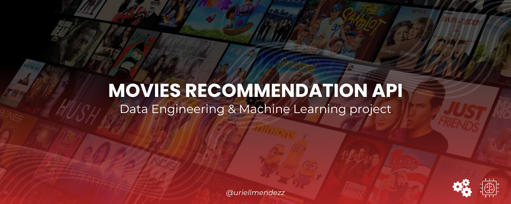

# Proyecto API Recomendaciónes de Películas




El objetivo de este proyecto es poder adquirir y consultar información de peliculas a traves de una API. Esta misma fue desarrollada gracias al framework de **FastAPI** y desplegada posteriormente en la plataforma de **Render**. Ademas, el proyecto cuenta con un sistema de recomendación de películas que utiliza un modelo de machine learning basado en el coseno de similitud. Este enfoque permite calcular la similitud entre los títulos, géneros y directores de las películas con el objetivo de proporcionar recomendaciones más precisas. Al calcular el coseno de similitud, el modelo evalúa a traves de lo que se conoce como la <u>*matriz de similitud*</u> la proximidad entre los diferentes elementos mensionados anteriormente y genera recomendaciones de películas similares a las que se solicitan.

Gracias a esta técnica, el sistema de recomendación puede ofrecer resultados más acertados al encontrar películas que comparten características y temáticas similares a las requeridas por el usuario.


[→ Link de la API ←](https://movies-api-uriel-mendez.onrender.com) 
##### *(Te recomiendo abrir el link en otra pestaña e incluir zoom a la página para una mejor visualización)*


## 📖 Índice

- [Introducción](#introducción)
- [Descripción de Archivos](#descripción-de-archivos)
- [Procesos ✅](#procesos)
  - [Extracción, Transformación y Carga de Datos (ETL)](#extracción-transformación-y-carga-de-datos-etl)
  - [Creación de la API](#creación-de-la-api)
  - [Análisis Exploratorio de Datos (EDA)](#análisis-exploratorio-de-datos-eda)
  - [Creación del Modelo de Machine Learning](#creación-del-modelo-de-machine-learning)
- [Requirimientos](#requisitos)
- [Uso de la API](#uso-de-la-api)
- [Contribuciones](#contribuciones)


## Introducción

<span style="font-size: 20px;">👋</span> Este proyecto es un ejemplo de cómo se pueden combinar los campos de Data Engineering y Machine Learning para crear una API sencilla y potente. La implementación de esta API implica la realización de tareas de data engineering, como la extracción, transformación y carga (ETL) de datos, y también incorpora técnicas de Machine Learning para proporcionar funcionalidades como la recomendación de películas.

Esta combinación crea una API que simula como los algoritmos de los servicios de streaming populares como Netflix, Disney+, Amazon Prime y muchos mas funcionan realmente, obviamente a una escala mucho menor computacionalmente pero que en definitiva busca realizar lo mismo, que es recomendar peliculas similares a los usuarios.


## Descripción de Archivos


<details>
<summary><strong>🗂️<em> notebooks</em></strong>: Tiene archivos Jupyter Notebooks</summary>

- *`ETL_process`*: Carpeta que contiene archivos *.ipynb* del proceso de ETL
- *`EDA_process`*: Carpeta que contiene un archivo *.ipynb* del proceso de EDA
- *`test_functions.ipynb`*: Notebook para probar las funciónes de la API
</details>

<details>
<summary><strong>🗂️<em> final_data</em></strong>: Tiene archivos CSV</summary>

- *`actors_data.csv`*: Archivo *.csv* con los actores de cada pelicula
- *`combined_data.csv`*: Archivo *.csv* fusionado
- *`final_cast.csv`*: Archivo *.csv* con datos de cada personaje de cada pelicula
- *`final_crew.csv`*: Archivo *.csv* con datos de el equipo de producción de cada pelicula
- *`final_movies.csv`*: Archivo limpio *.csv* con datos de todas las peliculas 
</details>

<details>
<summary><strong>🗂️<em> original_datasets</em></strong>: Tiene archivos CSV</summary>

- *`credits.csv`*: Archivo *.csv* con los datos originales/crudos sobre los creditos
- *`movies_dataset.csv`*: Archivo *.csv* con los datos originales sobre las peliculas
</details>

<details>
<summary><strong>🗂️<em> preprocessing_data</em></strong>: Tiene archivos CSV</summary>

- *`cast.zip`*: Archivo comprimido *.zip* con datos en diccionarios anidados sobre el elenco de cada pelicula
- *`crew.csv`*: Archivo *.csv* con datos en diccionarios anidados sobre el equipo de producción de cada pelicula
</details>

<summary><strong>🐍<em> main.py</em></strong>: Archivo <em>.py</em> con las funciónes de la API</summary>

<summary><strong>📗<em> README.md</em></strong>: Archivo <em>.md</em> con la documentación del proyecto</summary>

<summary><strong>⚠️<em> requirements.txt</em></strong>: Archivo <em>.txt</em> con las dependencias requeridas para el proyecto</summary>

<br>


## Procesos

✅ El desarrollo de este proyecto involucró varios procesos clave:


### Extracción, Transformación y Carga de Datos (ETL)

🧹 El primer paso consistió en realizar el proceso de extracción, transformación y carga (ETL) de los datos de películas. Se recopilaron dos grandes archivos CSV, 'credits.csv' conteniendo información sobre el elenco y el equipo de produccion que participa en cada filmación y por otro lado 'movies_dataset.csv' con información mas precisa sobre cada pelicula, como por ejemplo a que coleccion y géneros pertenece cada filmación, la duración en minutos, datos financieros como el presupuesto, la ganancia y el retorno de inversion de cada una y muchas variables mas. 

Cada archivo requirio de muchas transformaciones ya que contenian en sus valores algunos campos con diccionarios anidados, es decir, información comprimida. Gracias a la libreria de **Pandas**, lo que se hizo fue limpiar y organizar toda la información en varias columnas, <u> consiente de estar extendiendo los dataframes pero optimizando su utilidad a la hora de hacer consultas</u>. Luego del extenso proceso de limpieza y transformaciónes, se realizo una fusion (merge) entre ambos dataframes con las columnas de utilidad.


### Creación de la API

🛠️ Una vez obtenido el conjunto de datos de una manera mas efectiva y facil para realizar consultas, utilizando el framework de **FastAPI**, se creo la API en un archivo de Python (main.py) y finalmente fue desplegada en la plataforma de **Render** para que cualquier usuario en la red pueda acceder a ella.


Esta consta de varias funciones las cuales le permiten al usuario que interactua con la misma poder obtener información sobre las peliculas. Algunas de estas son las siguientes:

- **Consultar la cantidad de filmaciones en un mes determinado**

- **Consultar la cantidad de filmaciones en un día de la semana determinado** 

- **Obtener el año de estreno y el puntaje de popularidad en el mundo del cine de una película por su título**

- **Conseguir la cantidad de votos y el valor promedio de las valoraciones de una película por su título** 

- **Consultar por la cantidad de filmaciones en las que aparece un actor en especifico, el retorno total generado por sus peliculas y el retorno promedio por pelicula del actor.**

- **Buscar un director en especifico y obtener el retorno total generado por sus películas y detalles de cada película dirigida por él, como el título, el año de lanzamiento, el retorno individual, el costo y la ganancia.**

<br>

Además de estas funciones, cabe recalcar que la API también cuenta con un **sistema de recomendación basado en Machine Learning**. De este modo, el usuario podra obtener una lista con cinco peliculas recomendadas en función de una película específica.


*Es importante destacar que los datos disponibles en la API abarcan un período de **146 años**, que va desde peliculas del año 1870 hasta la actualidad. Esto significa que se pueden realizar consultas y obtener información sobre películas en un extenso período de tiempo, brindando un amplio panorama histórico del mundo del cine.*

<br>


### Análisis Exploratorio de Datos (EDA)

🕵️‍♀️ Una vez con la información sumamente limpia y luego de la creación de la API, el proceso que le sigue es el EDA. Es crucial para entender como se comportan los datos que tengo en el dataset, para encontrar patrones y tenedecias y obtener información a traves de los graficos. En este análisis exploratorio, hice lo siguiente:


1. ***Información basica del dataset*** <br>
Primero y principal fue conocer cual era el tamaño del conjunto de datos que se estaba por analizar. Averigue los tipos de datos presentes en el dataset, lo que me permitió identificar las variables numéricas y de texto. Además, gracias al diccionario de columnas que se me dio al comenzar el proyecto, pude comprender el significado de cada variable presente en el DataFrame.

2. ***Análisis estadistico*** <br>
Verifiqué si había valores nulos en el conjunto de datos y calculé el porcentaje de nulos en cada columna. También utilicé el coeficiente de asimetría (skewness) para evaluar la simetria de las variables numéricas. Consideré como simétricas aquellas variables cuyo coeficiente de asimetría estaba entre -0.5 y 1.5 e identifiqué las variables asimetricas, la cuales sus coeficientes eran o menor que -0.5 o mayor que 1.5.

3. ***Análisis temporal*** <br>
Realicé un análisis de la extensión temporal de los datos en el conjunto, utilizando la columna "release_date". Determiné el rango de años de las películas en el conjunto y calculé la cantidad de películas por año. Grafiqué un histograma para visualizar la distribución de las películas a lo largo de los años. Además, realicé un análisis adicional para distinguir entre películas que no tenian animaciones (antes de 1985) y las que si (desde 1985 en adelante). Tambien hice un grafico para poder visualizar el numero de peliculas de cada decada, siendo las mas cercanas a la actualidad con el mayor numero de peliculas. 

4. ***Análisis de palabras clave en titulos de películas*** <br>
Utilicé la libreria *'wordcloud'* para crear una nube de palabras que representara las palabras clave en los títulos de las películas. Cuestion que al visualizarla, identifique las palabras más frecuentes en los titulos. Esto me permitio tener un primer acercamiento sobre los géneros y temas más comunes en las películas segun las palabras mas grandes del grafico. Conclui que en su mayoria, el dataset contenia peliculas de género romance/amor y tambien de drama.

5. ***Analisis de géneros de películas*** <br>
Luego de la nube de palabras, realicé un analisis de los géneros de películas presentes en el conjunto de datos. Conté la cantidad de películas por género y creé un gráfico de barras para visualizar los resultados. Identifiqué los géneros más frecuentes en el conjunto de datos y obtuvé conclusiones sobre la distribución de géneros. Ademas, con otro grafico de barras que muestra la valoracion promedio de cada género, pude notar cuales era los géneros cinematograficos mas aclamados por las personas.

6. ***Analisis de países de producción*** <br>
Exploré la columna "production_countries" para identificar los países de producción de las películas. Nuevamente cree un grafico de barras para ver la cantidad de películas producidas por país y obtuvé conclusiones sobre los países más frecuentes en la producción de películas.

7. ***Correlación entre variables númericas*** <br>
Gracias a una matriz de correlación pude notar cuales eran las variables que tenian una fuerte correlación como por ejemplo mientras mayor era el numero de votaciones que tenia la pelicula, mayor era la ganacia de la misma. Obviamente no puedo afirmar que la cantidad de votaciones es la cuasa directa de las grandes ganacias de una pelicula ya que hay que recordar que **una fuerte correlacion no implica causalidad**


### Creación del Modelo de Machine Learning

🧠 Para el sistema de recomendación, primero desarrolle y probe el modelo de Machine Learning en un notebook y luego, una vez con todo listo, cree la función de recomendación dentro del archivo 'main.py' en el cual se iba a ejecutar la API.

Empece este proceso seleccionando solamente las columnas de interes ya que debia intentar tener la menor cantidad de data y al mismo tiempo data de calidad para que la API al momento de procesarla no se caiga ni tenga algun problema de memoria. Ademas, tuve en cuenta que el deploy en Render solo ofrece una memoria RAM de 512 mb para el procesamiento de datos, lo cual es muy poco y limita las posibilidades. 

Continuando, ahora solo con las columnas 'title' (nombre de la pelicula), 'genres' (género/s de la pelicula) y 'director' (director de la filamción), concatene toda esta info en un solo campo llamado 'joined_data'.

Luego de esto, con la libreria de ***'scikit-learn'***, cree un objeto vectorizador del estilo 'TfidfVectorizer' que me serviria para poder convertir a 'joined_data' (el titulo, género y director de cada pelicula) en una matriz numérica que despues utilizaria para calcular la similitud entre la información de cada película. Posteriormente, tome la decision de eliminar a las peliculas que en el campo de 'genres' tenian un valor vacio ya que sabia que luego el género de una pelcula me serviria para poder filtrar la data y solo tener las filmaciones similares.

Ahora si, cree la función que vectoriza los datos utilizando el objeto **'vectorizer'** creado anteriormente y genera una matriz de similitud de puntuación entre las películas utilizando **'cosine_similarity'**. Gracias a esta matriz, pude obtener una lista con las cinco peliculas mas proximas (mas similares) a la puntuación de la pelicula requerida, siendo las primeras mas parecidas y las ultimas menos.


## Uso de la API


### **🎮 Para empezar a utilizar la API, te recomiendo que vayas a la siguiente pagina web con la documentación bien especifica:**
**https://movies-api-uriel-mendez.onrender.com/docs**

<br>

*La API proporciona varias rutas para acceder a diferentes funcionalidades. A continuación, se describe cada función y qué información se espera recibir y devolver:*

<br>

- Ruta: ***`/`***
- Descripción: Devuelve un mensaje de bienvenida para la API de Recomendación de Películas.
- Ejemplo de solicitud: https://movies-api-uriel-mendez.onrender.com

  ```json
  {
    "mensaje": "Movie Recommendation API"
  }
  ```
<br>
<br>

- Ruta: ***`/cantidad_filmaciones_mes/{mes}`***
- Descripción: Devuelve la cantidad de películas que se estrenaron históricamente en un mes específico.
- Parámetros de entrada: *mes* (str) - El mes en idioma español.
- Ejemplo de solicitud: https://movies-api-uriel-mendez.onrender.com/cantidad_filmaciones_mes/noVIEmbre

  ```json
  {
    "mes": "Noviembre",
    "cantidad_fimaciones_mes": 4620.0
  }
  ```

<br>
<br>

- Ruta: ***`/cantidad_filmaciones_dia/{dia}`***
- Descripción: Devuelve la cantidad de películas que se estrenaron históricamente en un día específico de la semana.
- Parámetros de entrada: *dia* (str) - El día de la semana en idioma español.
- Ejemplo de solicitud: https://movies-api-uriel-mendez.onrender.com/cantidad_filmaciones_dia/sabado

  ```json
  {
    "dia": "Sabado",
    "cantidad_filmaciones_dia": 5144
  }
  ```

<br>
<br>


- Ruta: ***`/score_titulo/{titulo}`***
- Descripción: Devuelve el título, año de estreno y puntaje de una película específica.
- Parámetros de entrada: *titulo* (str) - El título de la película.
- Ejemplo de solicitud: https://movies-api-uriel-mendez.onrender.com/score_titulo/Avatar

  ```json
  {
    "titulo": "Avatar",
    "anio": 2009,
    "popularidad": 185.070892
  }
  ```
<br>
<br>


- Ruta: ***`/votos_titulo/{titulo}`***
- Descripción: Devuelve el título de una película, la cantidad de votos y la valoración promedio. 
- Parámetros de entrada: *titulo* (str) - El título de la película.
- Ejemplo de solicitud: https://movies-api-uriel-mendez.onrender.com/votos_titulo/Minions

  ```json
  {
    "titulo": "Minions",
    "anio": 2008,
    "votos": 4729,
    "valoracion_promedio": 6.4,
    "mensaje": null
  }
  ```
<br>
<br>

- Ruta: ***`/get_actor/{nombre_actor}`***
- Descripción: Devuelve información sobre un actor, incluyendo la cantidad de filmaciones en las que ha participado y el promedio de retorno.
- Parámetros de entrada: *nombre_actor* (str) - El nombre del actor.
- Ejemplo de solicitud: https://movies-api-uriel-mendez.onrender.com/get_actor/Jim%20Carrey

  ```json
  {
    "actor": "Jim Carrey",
    "cantidad_filmaciones": 42,
    "retorno_total_del_actor": 114.35521099633027,
    "promedio_de_retorno_por_pelicula": 2.7227431189602447
  }
  ```

<br>
<br>

- Ruta: ***`/get_director/{nombre_director}`***
- Descripción: Devuelve información sobre un director, incluyendo el retorno total de sus películas y detalles de cada película (título, año de lanzamiento, retorno, presupuesto y ganancias).
- Parámetros de entrada: *nombre_director* (str) - El nombre del director.
- Ejemplo de solicitud: https://movies-api-uriel-mendez.onrender.com/get_director/James%20Cameron

  ```json
  {
    "director": "James Cameron",
    "retorno_total_director": 54.23441585285313,
    "peliculas_dirigidas": [
        {
            "titulo": "True Lies",
            "anio_estreno": "1994",
            "retorno_inversion": 3.2946296608695653,
            "presupuesto": 115000000.0,
            "ganancias": 378882411.0
        },
        {
            "titulo": "Terminator 2: Judgment Day",
            "anio_estreno": "1991",
            "retorno_inversion": 5.2,
            "presupuesto": 100000000.0,
            "ganancias": 520000000.0
        },
        {
            "titulo": "The Abyss",
            "anio_estreno": "1981",
            "retorno_inversion": 1.2857156857142855,
            "presupuesto": 70000000.0,
            "ganancias": 90000098.0
        },
        {
            "titulo": "Aliens",
            "anio_estreno": "1987",
            "retorno_inversion": 9.908997567567567,
            "presupuesto": 18500000.0,
            "ganancias": 183316455.0
        },
        {
            "titulo": "The Terminator",
            "anio_estreno": "1989",
            "retorno_inversion": 12.2455,
            "presupuesto": 6400000.0,
            "ganancias": 78371200.0
        },
        {
            "titulo": "Titanic",
            "anio_estreno": "1996",
            "retorno_inversion": 9.22517094,
            "presupuesto": 200000000.0,
            "ganancias": 1845034188.0
        },
        {
            "titulo": "Piranha Part Two: The Spawning",
            "anio_estreno": "2002",
            "retorno_inversion": 0.0,
            "presupuesto": 145786.0,
            "ganancias": 0.0
        },
        {
            "titulo": "Ghosts of the Abyss",
            "anio_estreno": "2003",
            "retorno_inversion": 1.3108362307692307,
            "presupuesto": 13000000.0,
            "ganancias": 17040871.0
        },
        {
            "titulo": "Aliens of the Deep",
            "anio_estreno": "2004",
            "retorno_inversion": 0.0,
            "presupuesto": 0.0,
            "ganancias": 0.0
        },
        {
            "titulo": "Avatar",
            "anio_estreno": "2009",
            "retorno_inversion": 11.763565767932487,
            "presupuesto": 237000000.0,
            "ganancias": 2787965087.0
        },
        {
            "titulo": "Avatar 2",
            "anio_estreno": "2006",
            "retorno_inversion": 0.0,
            "presupuesto": 0.0,
            "ganancias": 0.0
        },
        {
            "titulo": "T2 3-D: Battle Across Time",
            "anio_estreno": "2015",
            "retorno_inversion": 0.0,
            "presupuesto": 0.0,
            "ganancias": 0.0
        }
    ]
  }
  ```

<br>
<br>

- Ruta: ***`/recomendacion/{title}`***
- Descripción: Obtiene recomendaciones de películas similares a una película dada.
- Parámetros de entrada: *title* (str) - El título de la película.
- Ejemplo de solicitud: https://movies-api-uriel-mendez.onrender.com/recomendacion/Iron%20Man

  ```json
  {
    "peliculas_similares": [
        "Iron Man 2",
        "Iron Man 3",
        "The Invincible Iron Man",
        "The Core",
        "Tetsuo: The Iron Man"
    ]
  }
  ```

<br>


## Requirimientos

⚠️ Si deseas utilizar la API de manera local en tu computadora, deberas tener instalado en tu entorno virtual las siguientes herramientas:

- pandas
- numpy
- scikit-learn
- uvicorn
- fastapi

Te facilito el siguiente comando para que puedas descargar los paquetes usando `pip`:

```shell
pip install pandas numpy scikit-learn uvicorn fastapi
```

<br>


## Contribuciones

😉 Si te interesa agregar valor al proyecto, tu contribución será bienvenida de mi parte. Te sugiero que clones este repositorio en tu computadora para que puedas trabajar con el libremente de manera local.

   Para clonarlo, ejecuta el siguiente comando en tu terminal:
   
   ```
   git clone https://github.com/tu-usuario/Movies_Recommendation_API.git
   ```

   Acordate de cambiar `tu-usuario` con tu nombre de usuario de GitHub. Una vez hayas clonado el repositorio, podes crear una rama nueva para tus cambios y comenzar a trabajar en ella.


